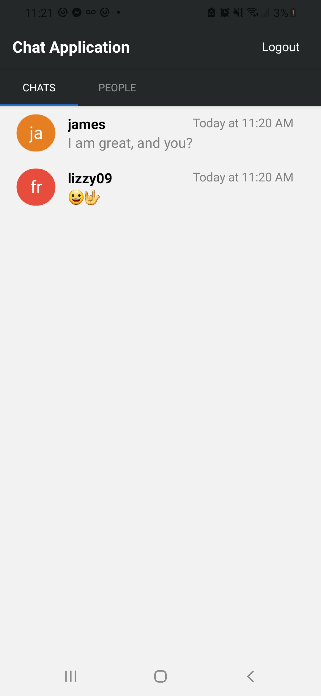
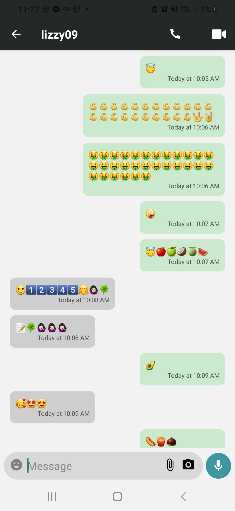

# Arduino Controller
 
 
 
 A mobile app controller project using React Native with the ability to generate pulse-width-modulation, turn on, turn off each individual pin of an Arduino.

Main Screen          | Chat Screen
:-------------------------:|:-------------------------
  | 

## Features

- Used AWS Amplifuy to handle the authentication
- Used Expo and React Native to create the mobile app.
